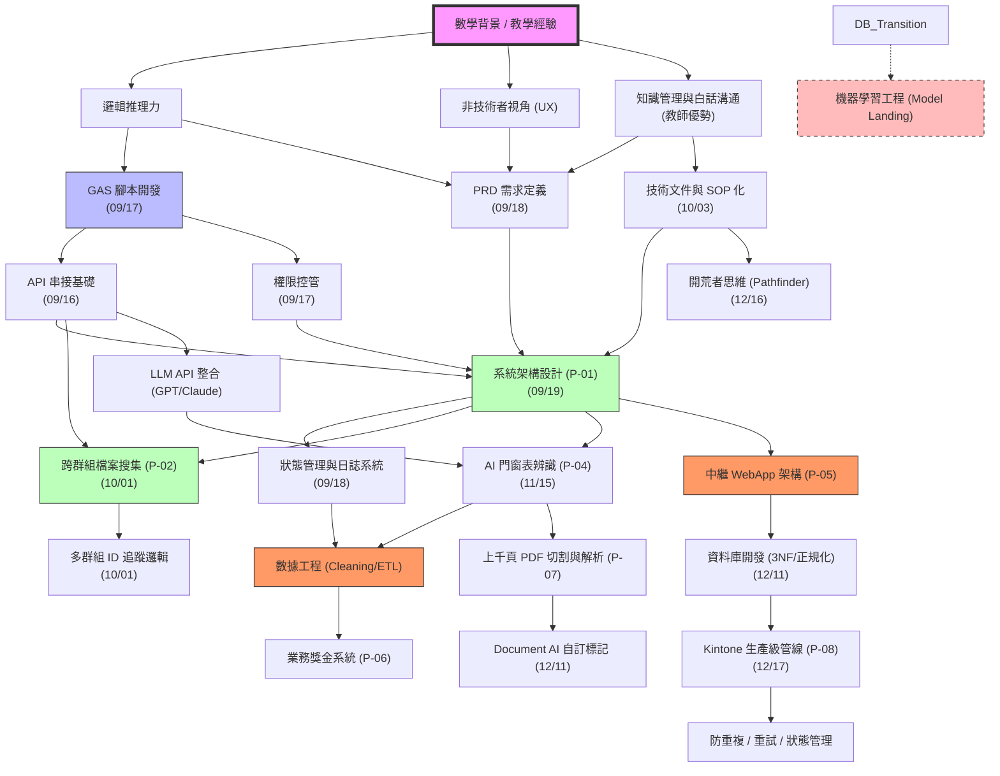

# 個人成長地圖 (Personal Growth Map)

這是一份動態更新的技能與職涯進化圖。它記錄了我如何從「非資訊背景」轉型為「AI 工程師」的過程，並將目前累積的「自動化能力」轉化為未來「機器學習」的基石。

## 🗺️ 技能演進圖 (Skill Tree)

## 🏆 當前能力等級 (Status)

| 領域 | 熟練度 | 關鍵里程碑 | 獲得日期 |
| :--- | :--- | :--- | :--- |
| **資料架構設計 (SA/DB)** | ⭐⭐⭐⭐⭐ | **主導公司 DB 轉型，完成實體拆分與正規化設計** | 2025-12-11 |
| **系統設計哲學** | ⭐⭐⭐⭐⭐ | **完成從「彈性」到「嚴格」的價值觀轉型 (12/18)** | 2025-12-18 |
| **數據工程 (DE)** | ⭐⭐⭐⭐⭐ | **完成 P-06 獎金系統與 P-07 上千頁文件解析管線** | 2025-12-11 |
| **產品定義 (PRD)** | ⭐⭐⭐⭐⭐ | 獨立撰寫 P-03 財務模型與 P-04 系統 PRD | 2025-10-09 |
| **自動化開發 (GAS)** | ⭐⭐⭐⭐⭐ | **實作 Kintone 生產級中繼管線 (Idempotency/Retry)** | 2025-12-17 |
| **AI 應用工程 (AI)** | ⭐⭐⭐⭐⭐ | **完成 Document AI 樣本標記與多階段推論工作流** | 2025-12-11 |
| **部署與運維 (Ops)** | ⭐⭐⭐⭐ | **處理 Cloud Run 平行處理與 API Key 備援機制** | 2025-11-25 |
| **職涯策略 (Growth)** | ⭐⭐⭐⭐⭐ | **通過試用期考核，確立「開路先鋒」角色定位** | 2025-12-16 |

> [!NOTE]
> 部分早期專案之日期為根據記憶推算之「大約時間」，若後續發現具體紀錄，將隨時修正更新。

## 🚀 未來進化路徑 (Roadmap)

### 1. 短期：自動化專家 (0-6 個月)
- [x] 掌握多群組 ID 追蹤與精準推播。
- [x] **建立第一份團隊內部的 API 串接知識庫/SOP**。
- [ ] 在公司內部推薦使用 Odoo/ERPNext 等開源框架。

### 2. 中期：AI 落地與架構師 (6-18 個月)
- [x] 將大模型 (GPT/Gemini) 整合進現有的自動化 Pipeline。
- [x] **實作生產級 API 容錯機制 (Retry/Log/Status)**。
- [ ] 實作第一個具備 RAG (檢索增強生成) 的企業內部知識庫機器人。
- [ ] 準備 **「開拓型架構師」** 履歷，向大廠/新創核心技術職位對齊。

### 3. 長期：ML 工程師 (18+ 個月)
- [ ] 轉向處理更核心的數據模型，實現「AI 工程師」的職稱實質化。

---
> **最後更新日期**：2025-12-17 (完成 Kintone 生產級管線實作，確立開路者定位)
