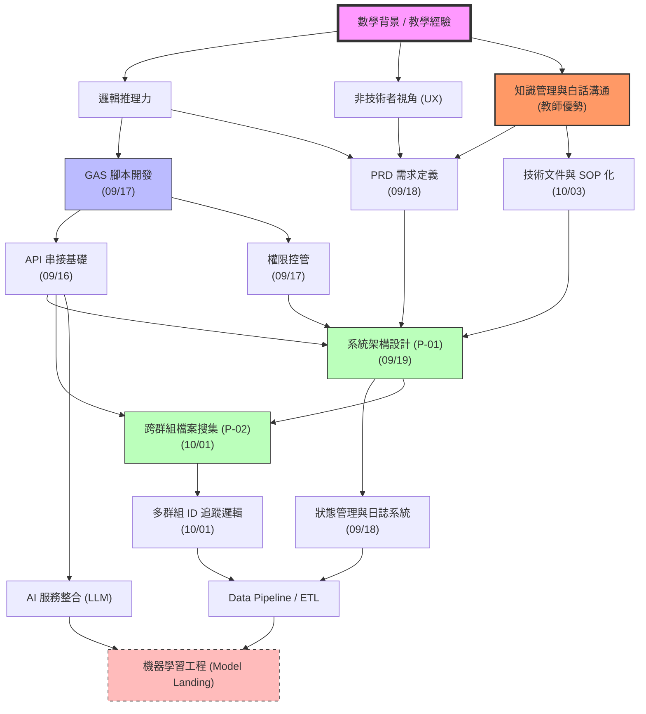

# 個人成長地圖 (Personal Growth Map)

這是一份動態更新的技能與職涯進化圖。它記錄了我如何從「非資訊背景」轉型為「AI 工程師」的過程，並將目前累積的「自動化能力」轉化為未來「機器學習」的基石。

## 🗺️ 技能演進圖 (Skill Tree)

## 🏆 當前能力等級 (Status)

| 領域 | 熟練度 | 關鍵里程碑 | 獲得日期 |
| :--- | :--- | :--- | :--- |
| **自動化開發 (GAS)** | ⭐⭐⭐ | 成功實作 P-01 兩階段系統 | 2025-09-17 |
| **產品定義 (PRD)** | ⭐⭐⭐ | 成功解析 09/24 複雜自動化需求 | 2025-09-24 |
| **API 串接** | ⭐⭐⭐ | 解決 LineBot Webhook 檔名缺失限制 | 2025-10-01 |
| **知識管理 (KM)** | ⭐⭐⭐ | **將教師背景轉換為團隊技術 SOP 力** | 2025-10-03 |
| **架構設計** | ⭐⭐⭐ | 建立 P-02 跨群組檔案驗證機制 | 2025-10-01 |
| **Gmail 自動化** | ⭐⭐ | 實現附件抓取與自動歸檔 | 2025-09-24 |
| **機器學習 (ML)** | ⭐ | (目標) 維持 Kaggle 清洗資料手感 | - |

## 🚀 未來進化路徑 (Roadmap)

### 1. 短期：自動化專家 (0-6 個月)
- [x] 掌握多群組 ID 追蹤與精準推播。
- [x] **建立第一份團隊內部的 API 串接知識庫/SOP**。
- [ ] 在公司內部推薦使用 Odoo/ERPNext 等開源框架。

### 2. 中期：AI 落地工程師 (6-18 個月)
- [ ] 將大模型 (GPT/Gemini) 整合進現有的自動化 Pipeline。
- [ ] 實作第一個具備 RAG (檢索增強生成) 的企業內部知識庫機器人。

### 3. 長期：ML 工程師 (18+ 個月)
- [ ] 轉向處理更核心的數據模型，實現「AI 工程師」的職稱實質化。

---
> **最後更新日期**：2025-10-01 (P-02 專案啟動)
